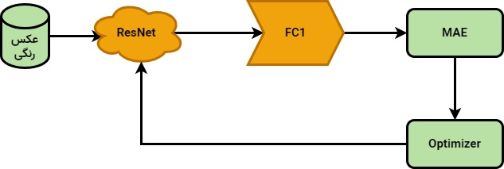

# عنوان پروژه
تخمین سن از روی چهره

# فهرست مطالب
<ul>
    <li><a href="#بیان مسئله">بیان مسئله</a></li>
    <li><a href="#روش های موجود">روش های موجود</a></li>
    <li>انتخاب روش</li>
    <li></li>
</ul>

# بیان مسئله
## معرفی پروژه
تخمین سن یکی از موضوعات چالش برانگیز بین انسان ها است. در این پروژه قصد داریم مدل هوش مصنوعی طراحی کنیم که سن افراد را از روی تصویر چهره آنها تشخیص بدهد. وجود فاکتورهای مختلف مانند سبک زندگی، نژاد و آرایش و ... روی تخمین اثرگذار هستند.

## اهداف
<ul>
    <li>توسعه روشی دقیق برای تخمین سن</li>
    <li>مقاوم به چالش های نورپردازی و تصویربرداری نامناسب</li>
    <li>مقاوم به چالش هایی همچون نژاد و جنسیت</li>
    <li>مقاوم به چالش هایی همچون نژاد و جنسیت</li>
    <li>امکان استفاده از پروژه به صورت بلادرنگ</li>
    <li>ارائه سرویس توسط ربات تلگرام</li>
</ul>

 

# روش های موجود

## تخمین سن با استفاده از رگرسیون و شبکه کانوولوشن/ترنسفورمر
مطابق کدهای ساده در اینترنت میتوان با استفاده از شبکه های معروف کانولوشنی/ترنسفورمری و تنظیم خروجی روی رگرسیون به خطای قابل قبول رسید. باید از مدل های معروف از پیش آموزش دیده و داده افزایی استفاده شود.

## تخمین سن با استفاده از دسته بندی و شبکه کانوولوشن/ترسنفورمر
مانند روش اول با این تفاوت که به جای استفاده از رگرسیون، مسئله مبتنی بر دسته بندی و با استفاده از تابع اتلاف کراس آنتروپی حل میشود. تعداد کلاس ها را میتوان برابر تعداد سال های موجود در دیتاست در نظر گرفت.

## بنچ مارک تخمین سن از روی چهره
یک فریمورک آماده برای تخمین سن تا افراد فعال در این حوزه از این فریمورک برای پیاده سازی ارزیابی و مقایسه کارهای خود با دیگران استفاده کنند. به صورت پیش فرض روش های مختلفی برای تخمین سن را پیاده سازی کرده است. 

## روش MiVOLO
روش متفاوت به صورتی که علاوه بر تصویر چهره افراد، از بخش های بدن مانند موی سر، دست ها و ... نیز استفاده کرده است. منطقی است که در سایر بخش های بدن هم اطلاعات مناسبی موجود باشد. جنسیت را نیز پیشبینی میکند. از شبکه ترنسفورمر استفاده شده است.

 

# انتخاب روش

## روش انتخابی
این پروژه با هدف افزایش مهارت توسعه داده میشود. درنتیجه انتخاب من روش پیشنهادی اول یعنی تخمین سن با استفاده از رگرسیون میباشد.

## مدل انتخابی
مدل انتخابی برای این پروژه با توجه به اهداف شبکه عصبی ResNet به همراه ترنسفرلرنینگ با وزن های ImageNet یا Face Recognition است. 

## داده ها
داده های خام از دیتاست <a href="https://www.google.com/url?sa=t&source=web&rct=j&opi=89978449&url=https://www.kaggle.com/datasets/abhikjha/utk-face-cropped&ved=2ahUKEwjv4tiruuuKAxWZ87sIHeg-OjcQFnoECBYQAQ&usg=AOvVaw0vrJa6KzDcoST2A01p3UVY">UTK face</a> استفاده شده است. عکس ها به صورت برش خورده چهره هستند. عکس ها در پوشه داده ذخیره میشود. 

## ساختار مدل سازی

